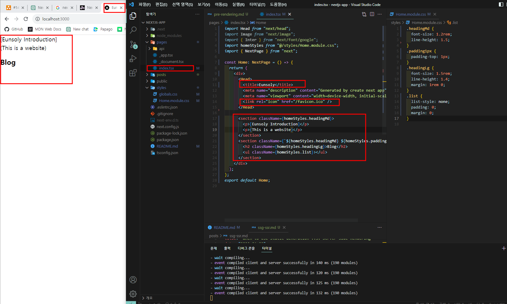
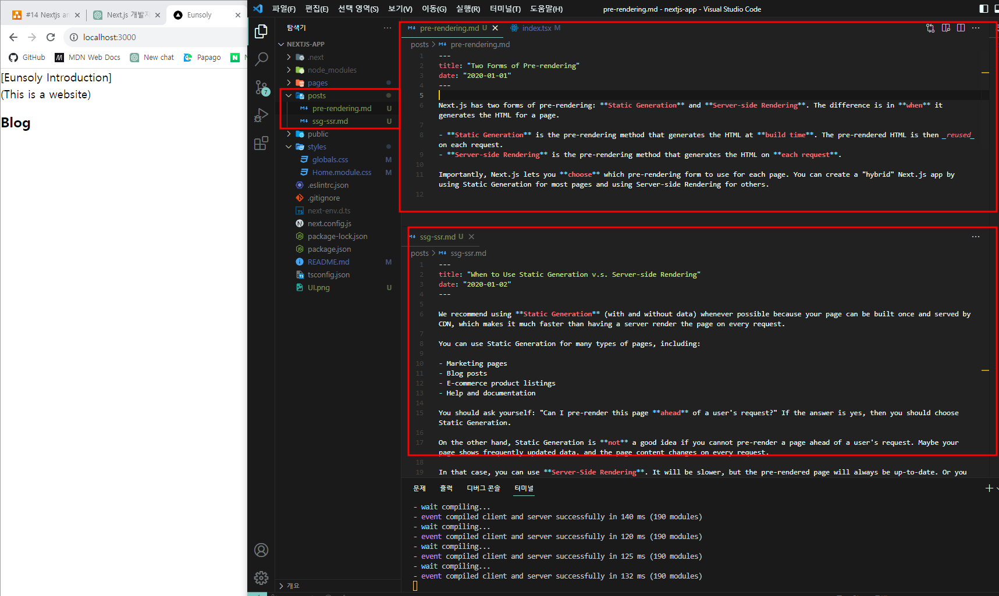
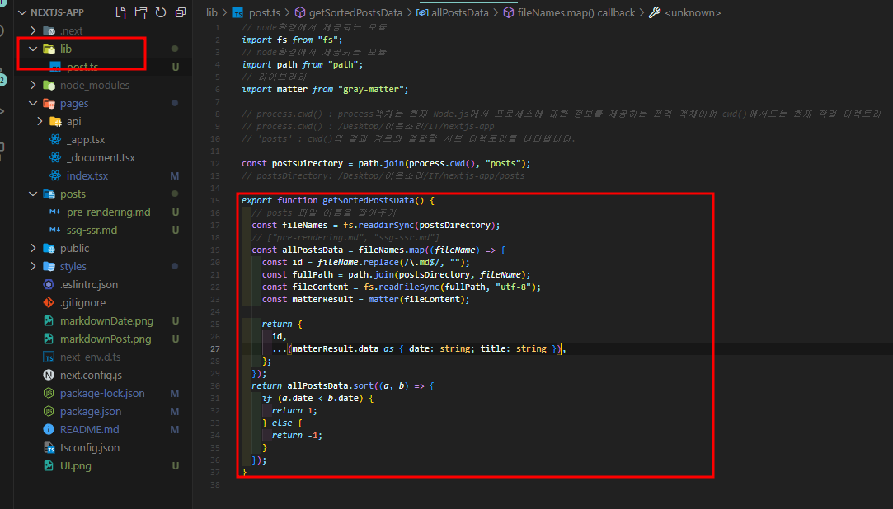
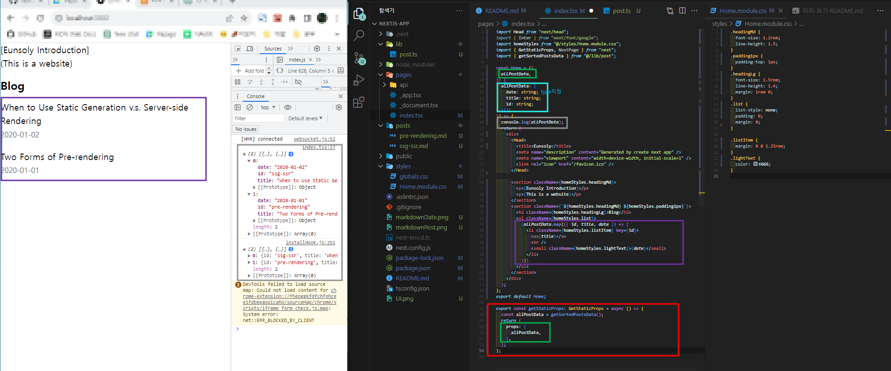
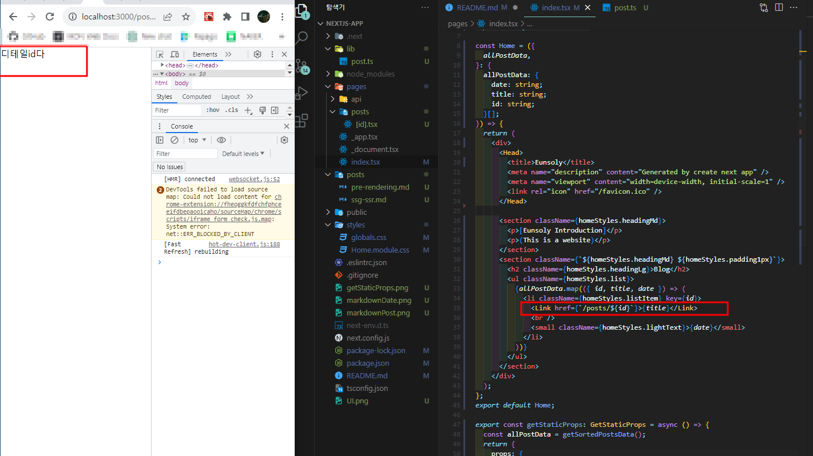
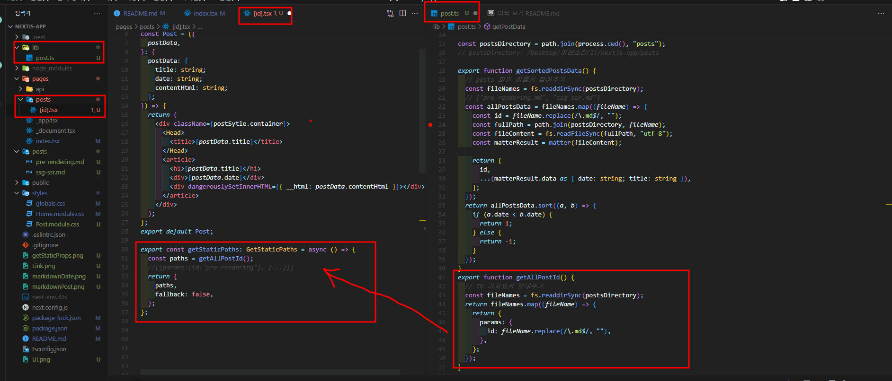
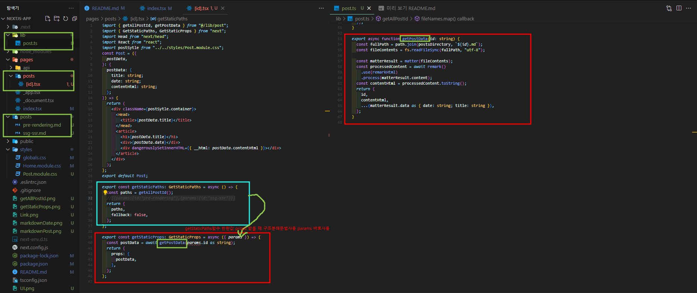

# Typescript를 사용한 Next.js 공홈 연습 BlogApp 만들어보기

[참고사이트 Next.js 공홈](https://nextjs.org/learn/basics/data-fetching/blog-data)

### 📌 개발 언어

>  
> 
> 
> 

<br/>

## 🖐 프로젝트 내에서 사용한 내장모듈

### 📁 1.fs

> File System모듈은 파일시스템과 관련된 작업을 수행하는데 사용된다. 파일을 읽고 쓰기, 파일 및 디렉터리 생성 및 삭제, 파일의 상태 확인 등과 같은 파일 시스템 작업을 지원 fs모듈을 사용하면 파일과 폴더를 조작할 수 있다.

### 사용된 메서드

1. readdirSync : Node.js 환경에서 사용되는 파일 시스템 모듈(fs)의 동기식 메서드로 해당 메서드를 사용하면 특정 디렉터리 내에 있는 파일과 하위 디렉터리 목록을 동기적으로 읽어올 수 있다.

   ```
   // 예시 코드
   const files = fs.readdirSync(path[, options])
   // 현재 프로젝트에서 사용된 코드
   const fileNames = fs.readdirSync(postsDirectory);
   ```

   ※ path: 디렉터리 경로를 나타내는 문자열로, 읽고자 하는 디렉터리의 경로를 지정  
   ※ options (선택 사항): 옵션 객체로, 파일 목록을 읽는 데 사용되는 옵션을 설정  
   ※ 주어진 디렉터리(path) 내의 파일과 디렉터리 목록을 배열로 반환되며 반환된 배열에는 디렉터리와 파일의 이름이 포함되며, 배열의 각 요소는 각 파일 또는 디렉터리의 이름을 나타내는 문자열이다.

2. readFileSync : Node.js 환경에서 사용되는 파일 시스템 모듈인 fs의 동기식 메서드 중 하나로 파일의 내용을 동기적으로 읽어올 수 있다.

   ```
   // 예시코드
   const data = fs.readFileSync(path[, options])
   // 현재 프로젝트에서 사용코드
   const fileContents = fs.readFileSync(fullPath, "utf-8");
   ```

   ※path: 파일 경로를 나타내는 문자열로, 읽고자 하는 파일의 경로를 지정  
   ※options (선택 사항): 옵션 객체로, 파일 읽기 옵션을 설정하는 데 사용  
   ※주어진 파일(path)을 동기적으로 읽어와서 파일의 내용을 문자열 또는 버퍼(Buffer: 데이터를 임시로 저장하거나 다루기 위한 일시적인 메모리 공간)로 반환되며 반환되는 값의 형식은 options에 따라 달라진다.

### 📁 2.path

> 파일 경로와 관련된 작업을 수행하는데 사용되며 해당모듈은 파일 경로를 생성하고 조작하는데 도움을 준다. 예로 파일 경로를 연결하거나 파일의 디렉터리 이름, 확장자 등을 추출하는데 사용

사용된 메서드

1. cwd : 현재 작업 디렉터리(current working directory, cwd)의 경로를 반환하는 메서드로 process(현재 실행 중인 Node.js 프로세스에 대한 정보를 제공하는 전역객체)에서 사용할 수 있는 메서드다.

   ```
   // 프로젝트에서 사용코드
   import path from "path";
   const postsDirectory = path.join(process.cwd(), "posts");
   ```

## 🖐 프로젝트 내에서 사용한 라이브러리

### 📁 1.gray-matter

[NPMJS](https://www.npmjs.com/package/gray-matter)

> JavaScript 환경에서 Markdown 파일을 파싱하고 관리하는데 도움을 주는 라이브러리로 주로 Node.js 환경에서 사용되며, Markdown 파일의 메타 데이터를 추출하거나 Markdown 내용을 가져오는 데 사용 해당 라이브러리를 사용하면 Markdown 파일 내부의 메타 데이터를 쉽게 읽고 사용할 수 있다.

### 📁 2.remark, remark-html

[NPMJS_remark](https://www.npmjs.com/package/remark)  
[NPMJS_remark-html](https://www.npmjs.com/package/remark-html)

1. remark
   > ※ markdown처리 : remark는 markdown 문법을 파싱하고 처리하는 도구로 markdown은 텍스트 기반 마크업 언어로 간단한 문법을 사용하여 텍스트를 서식있는 HTML로 변환할 수 있다.  
   > ※ AST (Abstract Syntax Tree) 구축: remark는 Markdown 문서를 파싱하여 AST를 구축합니다. 이 AST는 Markdown 문서의 구조를 나타내는 트리 구조로, Markdown 요소를 JavaScript 객체로 표현한다.  
   > ※ 플러그인 시스템: remark는 플러그인 시스템을 통해 확장 가능하며, 다양한 Markdown 확장 구문을 지원, 사용자 정의 플러그인을 작성하여 Markdown 처리를 확장할 수 있음
2. remark-html
   > HTML로 변환: remark-html은 remark로 파싱된 Markdown AST를 HTML 문자열로 변환하는 역할을 해준다 즉, Markdown 문서를 HTML로 렌더링하는 데 사용  
   > 설정 가능한 변환: remark-html은 변환된 HTML의 출력을 사용자 정의할 수 있는 옵션을 제공한다. 예를 들어, 특정 HTML 요소에 클래스를 추가하거나 스타일을 적용할 수 있다.
   ```
   // 프로젝트 내에서 사용코드
   const matterResult = matter(fileContents);
      const processedContent = await remark()
      .use(remarkHtml)
      .process(matterResult.content);
   const contentHtml = processedContent.toString();
   ```

---

### 작업 정리

1.  UI 구성
    
2.  markdown으로 Blog 포스트 파일 생성하기
    
3.  markdown파일을 데이터로 추출하기
    > 마크다운으로 작성한 파일을 바로 데이터로 사용할 순 없기 때문에 데이터로 전환하여 추출하도록해야한다.
    > 
4.  추출된 데이터의 Blog List 나열하기
    > getStaticProps사용해서 데이터 가져오기
    > 
    > getStaticProps: Next.js 빌드 시점에 해당 페이지를 사전 렌더링 후 정적파일로 저장
5.  자세히 보기 기능구현 (file system기반의 라우팅)
    > 5-1. 동적경로 연결 import Link from "next/link";
    >  title을 클릭하면 해당 페이지로 이동
    > 5-2. 클릭한 title에 맞는 데이터 보여주기
    > (1. post 데이터를 가져와야하는 경로 목록 가져오기)
    > 
    > ※ getAllPostId 받아온 경로 목록 : [{params:{id:"pre-rendering"},{params:{id:"ssg-ssr"}}]
    > (2. 가저온 경로를 이용하여 포스트 데이터 가져오기)
    > 
    > ※ params로 받은 경로 목록의 id를 활용하여 해당 id와 일치하는 파일을 찾아서 HTML 파일로 변환작업(remark, remark-html사용) 이후 객체로 데이터를 담아서 return / retrun한 값을 받아서 postData로 최종반환 이후 데이터바인딩 진행
